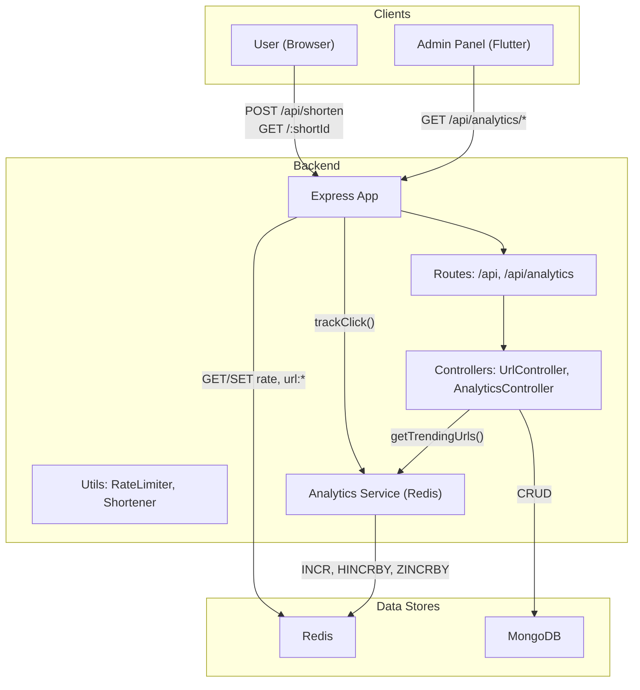
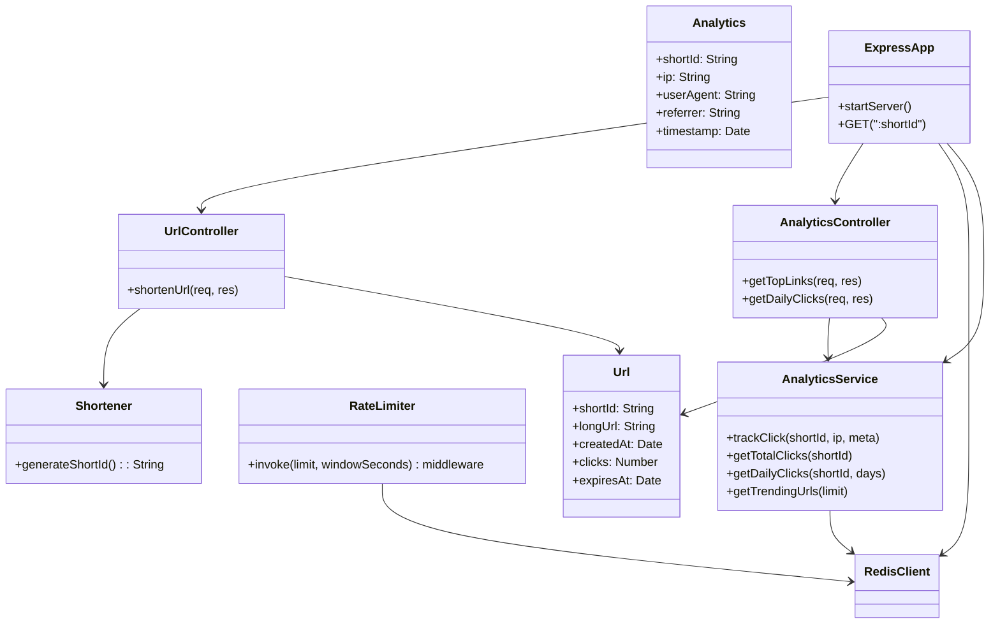
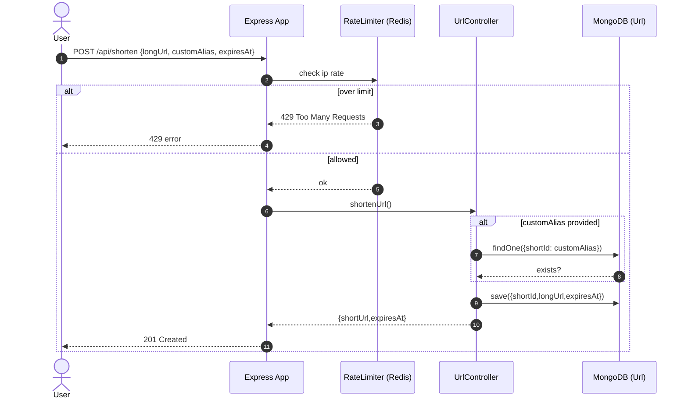
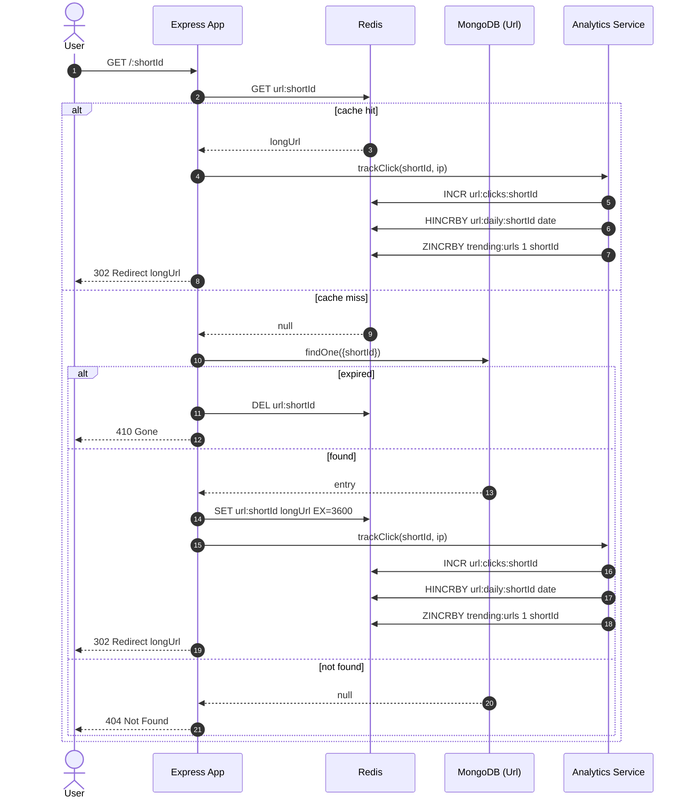
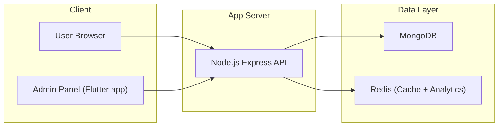

# URL Shortener – Full Stack Application

A complete URL shortening service with a modern React frontend and Node.js backend, featuring analytics, rate limiting, caching, and real-time statistics.

## 🚀 Features

### Frontend (React + Vite)
- 🌓 **Dark/Light Mode** - Toggle between themes with persistent storage
- 🔗 **URL Shortening** - Shorten URLs with optional custom aliases and expiration dates
- 📊 **Trending URLs** - View the most clicked shortened URLs
- 📈 **Analytics Dashboard** - Visualize daily click statistics with interactive charts
- 🎨 **Modern UI** - Beautiful, responsive design with smooth animations

### Backend (Node.js + Express)
- ⚡ **Fast Redirects** - Redis caching for instant URL lookups
- 🛡️ **Rate Limiting** - Protect API endpoints from abuse
- 📊 **Analytics** - Track clicks with Redis (ultra-fast in-memory analytics)
- 🔒 **URL Validation** - Comprehensive input validation
- ⏰ **Expiration Support** - Set expiration dates for shortened URLs
- 🎯 **Custom Aliases** - Create memorable short URLs

## 📋 Prerequisites

- Node.js (v18 or higher)
- MongoDB (v5 or higher)
- Redis (v6 or higher) - Required for analytics and caching

## 🛠️ Installation

### Backend Setup

1. Navigate to the backend directory:
```bash
cd backend
```

2. Install dependencies:
```bash
npm install
```

3. Create a `.env` file (copy from `.env.example`):
```bash
cp .env.example .env
```

4. Update `.env` with your configuration:
```env
MONGO_URL=mongodb://localhost:27017/url-shortener
REDIS_HOST=127.0.0.1
REDIS_PORT=6379
PORT=5000
BASE_URL=http://localhost:5000
```

5. Start the backend server:
```bash
npm run dev
```

The backend will run on `http://localhost:5000`

### Frontend Setup

1. Navigate to the frontend directory:
```bash
cd frontend
```

2. Install dependencies:
```bash
npm install
```

3. Create a `.env` file (optional, defaults to `http://localhost:5000/api`):
```env
VITE_API_URL=http://localhost:5000/api
```

4. Start the development server:
```bash
npm run dev
```

The frontend will run on `http://localhost:5173`

## 📁 Project Structure

```
URL Shortener/
├── backend/
│   ├── src/
│   │   ├── config/         # Database and service configurations
│   │   ├── controllers/     # Request handlers
│   │   ├── models/          # MongoDB models
│   │   ├── routes/          # API routes
│   │   ├── utils/           # Utility functions
│   │   ├── services/        # Analytics service (Redis-based)
│   │   └── utils/           # Utility functions
│   └── package.json
├── frontend/
│   ├── src/
│   │   ├── components/      # React components
│   │   ├── contexts/        # React contexts (Theme)
│   │   ├── services/        # API service layer
│   │   └── App.jsx
│   └── package.json
└── README.md
```

## 🔌 API Endpoints

### URL Shortening
- `POST /api/shorten` - Create a shortened URL
  ```json
  {
    "longUrl": "https://example.com",
    "customAlias": "optional-alias",
    "expiresAt": "2024-12-31T23:59:59Z"
  }
  ```

### Analytics
- `GET /api/analytics/top-links` - Get top 10 most clicked URLs (powered by Redis Sorted Sets)
- `GET /api/analytics/daily-clicks?shortId=<id>&days=<n>` - Get daily click statistics (powered by Redis Hashes)

### Redirect
- `GET /:shortId` - Redirect to original URL

## 🎨 Frontend Features

### URL Shortener Component
- Input validation for URLs
- Custom alias support (3-20 characters)
- Optional expiration date
- One-click copy functionality

### Trending URLs
- Real-time top 10 URLs
- Click count display
- Copy and open functionality
- Auto-refresh on new URL creation

### Analytics Chart
- Daily clicks visualization
- Bar and line chart modes
- Responsive design
- Interactive tooltips

## 🔧 Backend Improvements Made

1. **Enhanced URL Validation** - Proper URL format checking
2. **Better Error Handling** - Comprehensive error messages
3. **Custom Alias Validation** - Format and length validation
4. **Expiration Date Validation** - Ensures future dates only
5. **Redis Connection Fix** - Proper connection state checking
6. **IP Address Handling** - Fallback for IP extraction
7. **Analytics Enhancement** - Returns full URL information
8. **Route Protection** - Excludes API paths from shortId matching

## 🚦 Usage

1. Start MongoDB and Redis (if using)
2. Start the backend server: `cd backend && npm run dev`
3. Start the frontend: `cd frontend && npm run dev`
4. Open `http://localhost:5173` in your browser
5. Shorten URLs and view analytics!

## 📊 Architecture

Below are UML diagrams describing the backend system architecture and flows.

## Component diagram


## Class diagram


## Sequence diagram – Shorten URL


## Sequence diagram – Redirect and analytics


## Deployment diagram

