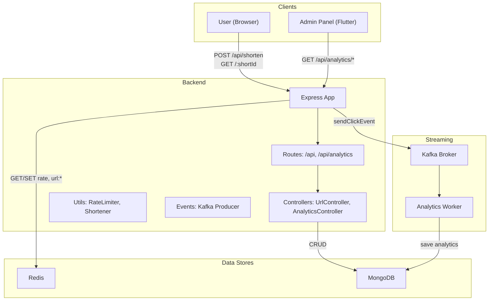
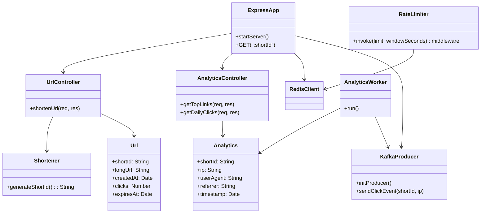
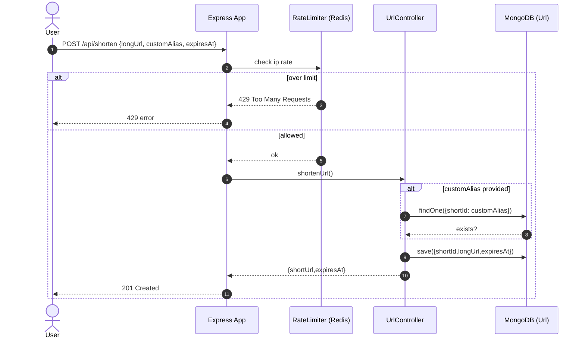
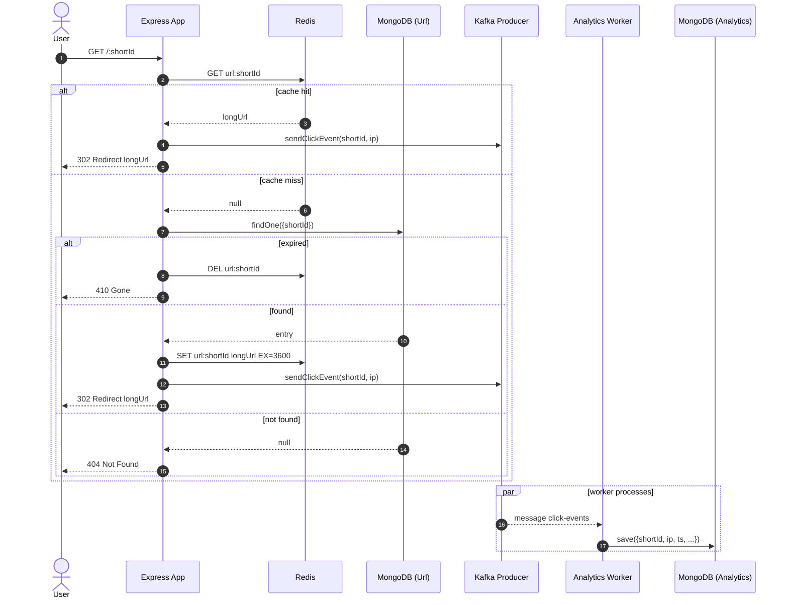
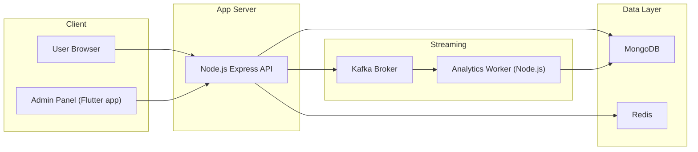

# URL Shortener – Backend UML

Below are UML diagrams describing the backend system architecture and flows.

## Component diagram

## Class diagram

## Sequence diagram – Shorten URL

## Sequence diagram – Redirect and analytics

## Deployment diagram

